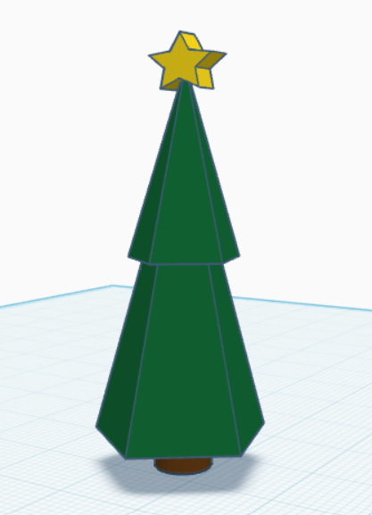

# O Tremendo Jaban

Este projeto contempla um arquivo de impressão 3D de uma árvore de natal.

# Informações

Neste repositório, existem três arquivos 3D, sendo eles:
- `obj.mtl`: Arquivo de material da árvore de natal;
- `tinker.obj`: Arquivo de objeto da árvore de natal;
- `CE3PRO_tremendo_jaban`: Arquivo de impressão 3D da árvore de natal para a impressora 3D Creality Ender 3 Pro.

Para que a impressão 3D seja realizada com sucesso, é necessário que o arquivo `CE3PRO_tremendo_jaban` seja utilizado na impressora 3D Creality Ender 3 Pro.

# Imagem

Abaixo, é possível visualizar o modelo 3D da árvore de natal:

